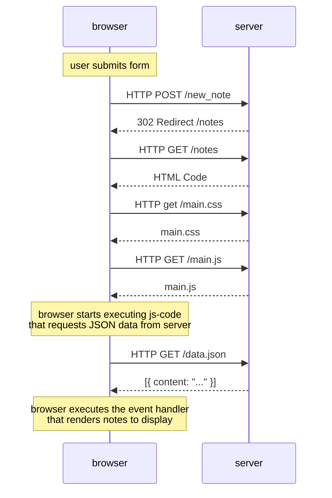

# Exercise 0.4

> "Create a similar diagram depicting the situation where the user creates a new note on page <https://studies.cs.helsinki.fi/exampleapp/notes> by writing something into the text field and clicking the submit button."

I created this sequence diagram using [mermaid.js](http://mermaid-js.github.io). You can render the diagram in their [online playground](https://mermaid-js.github.io/mermaid-live-editor).

